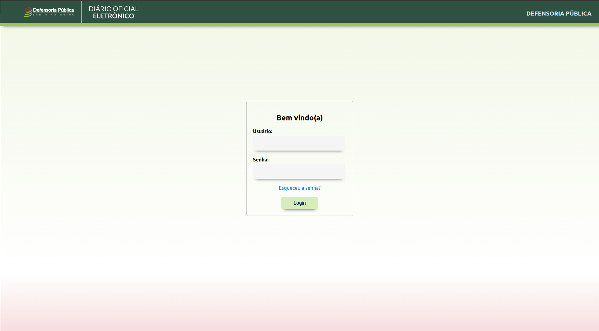
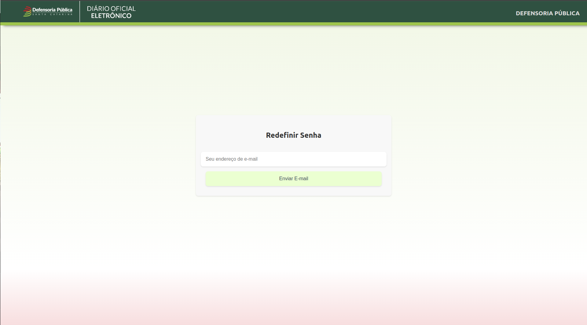
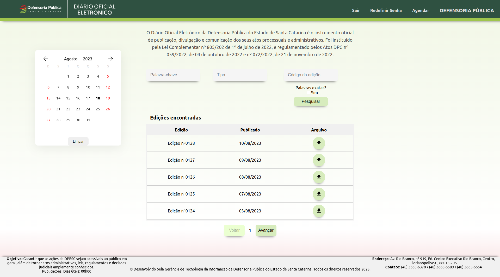
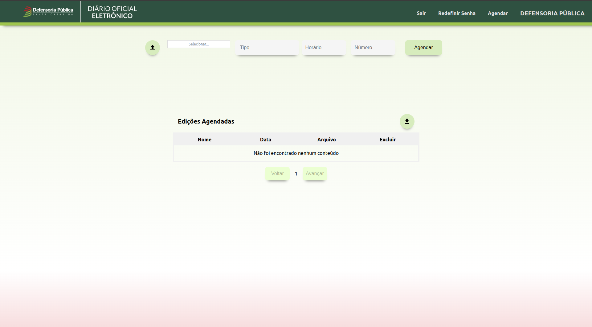

# Diário Oficial Eletrônico

Bem-vindo ao Diário Oficial Eletrônico! Este é um aplicativo web desenvolvido em React com TypeScript para permitir a visualização de notícias relacionadas ao estado de Santa Catarina. A aplicação permite que os administradores façam postagens de notícias, enquanto os usuários podem acessá-las.

## Funcionalidades

- Visualização de Notícias: Navegue pelas notícias mais recentes de Santa Catarina.
- Postagem de Notícias: Apenas administradores podem criar novas postagens de notícias com o código da notícia, arquivo, tipo de notícia e data de publicação.
- Busca: Pesquise notícias específicas com base em palavras-chave, data ou tipo de notícia.
- Interação: Os usuários podem pesquisar e baixar as notícias.

## Pré-requisitos

Certifique-se de ter o Node.js instalado em sua máquina.

## Instalação

1. Clone este repositório: `git clone https://https://github.com/viniciusnau/diario-oficial-front`
2. Navegue até o diretório do projeto: `cd diario-oficial-front`
3. Instale as dependências: `npm install`

## Uso

1. Inicie o servidor de desenvolvimento: `npm start`
2. Abra o seu navegador e acesse: `http://localhost:3000`

## Contribuição

Contribuições são bem-vindas! No entanto, apenas administradores têm permissão para fazer postagens neste projeto. Se você deseja reportar problemas ou sugestões, sinta-se à vontade para entrar em contato.

---

Agradecemos por escolher o Diário Oficial Eletrônico para se manter informado sobre as novidades locais! Esperamos que esta aplicação seja útil e atenda às suas expectativas. Apreciamos o seu apoio e contribuição.

## Páginas Técnicas:

### Página de Login

Legenda da imagem: Página de login exibindo os campos necessários para acessar a página restrita

A página de login é construída com React e TypeScript, e permite que administradores acessem o sistema por meio de autenticação. As credenciais são enviadas via requisição POST para um endpoint no backend, onde são verificadas.

### Página de Redefinição de Senha

Legenda da imagem: Página de reset de senha, exibindo o campo de email para alterar/trocar a senha

A página de redefinição de senha permite que administradores recuperem suas senhas por meio do envio de um e-mail de redefinição. O processo envolve a geração de um token exclusivo, que é associado ao usuário e usado para validar a redefinição.

### Página Inicial (Lista de Diários Publicados)

Legenda da imagem: Página inicial exibindo as últimas notícias.

A página inicial é renderizada com componentes React e exibe os diários mais recentes. Os diários são obtidos por meio de requisições GET ao servidor e são exibidas na tabela com o arquivo a ser baixado para acessar as informações.

### Página de Status (Lista de Diários Agendados)

Legenda da imagem: Página de status exibindo a área de agendamento de diários e os diários agendados para publicação.

A página de status possui campos a serem preenchidos para efetuar o agendamento de um novo diário e também, exibe diários agendados para publicação futura. Semelhante à página inicial, utiliza componentes React para mostrar os diários agendados em cartões com detalhes, incluindo estado e data de agendamento.
